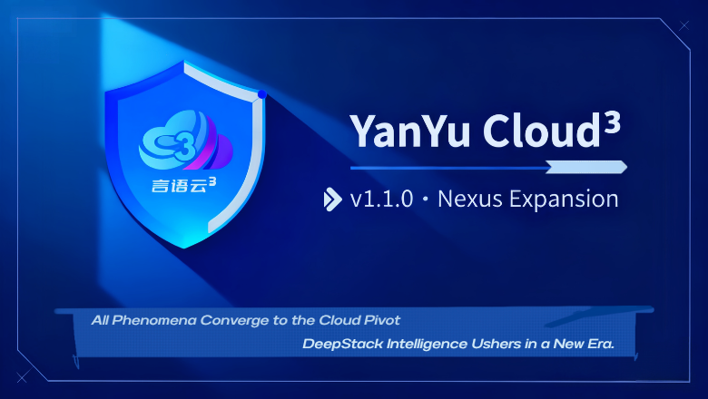

# 言語云³ 深度堆栈全栈智创引擎

<p align="center">
  
  <div style="display: flex; justify-content: center; align-items: center; gap: 20px;">
    <div style="text-align: center;">
      <svg width="80" height="80" viewBox="0 0 100 100" fill="none" xmlns="http://www.w3.org/2000/svg">
        <circle cx="50" cy="50" r="45" fill="#1a237e" stroke="#64b5f6" stroke-width="3"/>
        <text x="50" y="60" font-family="Arial, sans-serif" font-size="16" font-weight="bold" fill="white" text-anchor="middle">YYC³</text>
      </svg>
      <p style="margin-top: 5px; font-weight: bold;">项目徽标</p>
    </div>
  </div>
</p>

**版本**：1.0.0  
**文档编号**：YYC-README-20250703

## 🔗 目录
- [项目概述](#项目概述)
- [快速开始](#🚀-快速开始)
- [文档资源](#📚-文档资源)
- [主要功能模块](#🛠️-主要功能模块)
- [技术支持](#📱-技术支持)

## 项目概述

言語云³ 是一个基于 Next.js 15 的全栈智创引擎，集成了 AI 代码生成、应用开发、实时预览、代码审查、自动化生产、部署管理等功能。

YYC³ is a full-stack intelligent creation engine based on Next.js 15, integrating capabilities such as AI code generation, application development, real-time preview, code review, automated production, and deployment management.

## 🚀 快速开始

### 1. 安装和启动

```bash
# 安装依赖
npm install

# 启动开发服务器
npm run dev

# 构建生产版本
npm run build
```

### 2. 访问地址

- 开发环境：http://localhost:3000
- 生产环境：根据部署配置

## 📚 文档资源

- **用户指南**：[USER_GUIDE.md](USER_GUIDE.md) - 详细的功能说明和使用方法
- **架构文档**：[ARCHITECTURE.md](ARCHITECTURE.md) - 系统架构设计和组件说明
- **优化路线图**：[YYC3_OPTIMIZATION_ROADMAP.md](YYC3_OPTIMIZATION_ROADMAP.md) - 平台优化计划和实施路径
- **贡献指南**：[CONTRIBUTING.md](CONTRIBUTING.md) - 如何参与项目贡献
- **行为准则**：[CODE_OF_CONDUCT.md](CODE_OF_CONDUCT.md) - 项目参与者应遵守的准则

## 🛠️ 主要功能模块

- **🤖 AI 代码生成** - 智能代码补全和生成
- **🛠️ 应用开发** - 低代码可视化开发
- **👁️ 实时预览** - 代码和文档实时预览
- **📄 文件审查** - 文件分析和代码质量检测
- **📊 评分分析** - 多维度代码评分和优化建议
- **🔄 自动化生产** - CI/CD 流水线管理
- **🚀 部署管理** - 多环境部署和监控

## 📱 技术支持

## 🔗 相关链接
- **GitHub 仓库**：[YYC-EasyVizAI/yyc3-fsice](https://github.com/YYC-EasyVizAI/yyc3-fsice.git)

## 📧 联系我们
- **邮箱**：admin@0379.email

### 技术栈

- **前端框架**：Next.js 15
- **UI 组件**：自定义 Brand 组件系统
- **样式**：Tailwind CSS
- **动画**：Framer Motion
- **状态管理**：React Context + Hooks
- **类型系统**：TypeScript
- **构建工具**：Turbopack

### 移动端支持

- 响应式设计
- 触摸友好界面
- 移动端优化的导航
- 离线功能支持

## 🤝 社区与支持

### 获取帮助

- 查看项目文档：各功能模块详细说明
- 提交问题：GitHub Issues
- 联系开发团队

### 版本信息

- **当前版本**：1.0.0
- **最后更新**：2025年7月3日

---

**保持代码健康，稳步前行！ 🌹**
